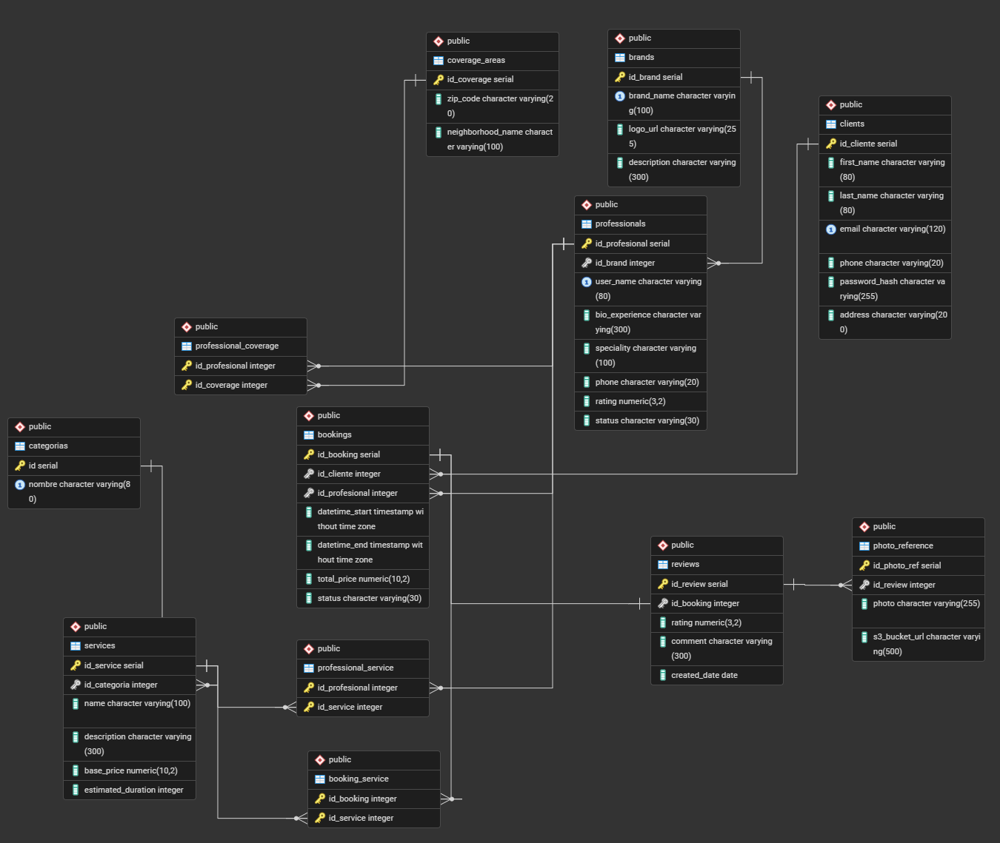

# BeautyAtHome - Sistema de Gestión de Belleza a Domicilio


## Descripción General del Proyecto

**BeautyAtHome** es una plataforma integral diseñada para conectar a profesionales de la belleza (estilistas, maquilladores, masajistas, etc.) con clientes que buscan servicios a domicilio. La aplicación permite gestionar usuarios (clientes y profesionales), reservar servicios, registrar catálogos, asignar coberturas por zonas, y calificar las experiencias recibidas.

El proyecto está diseñado con un fuerte enfoque en el **diseño y gestión de Bases de Datos Relacionales**, garantizando la integridad referencial, el manejo de relaciones (One-to-Many, Many-to-Many), y la persistencia de datos mediante un ORM (Object-Relational Mapping).

## Integrantes:

**Creador:** Santiago Andrés Benavides Coral - 20232020036
**Creador:** Miguel Andres Contreras Rodriguez - 20232020020
**Creador:** Sergio Nicolas Osorio Guevara - 20241020073
**Creador:** Adiel Valentin Hernandez  - 20201020144

**Asignatura:** Bases de Datos
**Profesor:** Rene Alejandor Lobo Quintero

## Requisitos previos

Java 21, PostgresSql, VS Code

## Arquitectura de la Base de Datos

La aplicación utiliza **PostgreSQL** como motor de base de datos principal, interactuando a través de **Spring Data JPA (Hibernate)**.

### Características principales de la BD:

1. **Normalización:** La base de datos sigue las reglas de normalización para evitar redundancia (ej: la separación de `brands`, `categories` y `coverage_areas`).
2. **Integridad Referencial:** Uso de Llaves Foráneas (`FOREIGN KEY`) con políticas de cascada (`ON DELETE CASCADE`) donde sea apropiado para mantener consistencia.
3. **Mapeo Objeto-Relacional (ORM):** Las tablas están representadas en Java usando anotaciones JPA (`@Entity`, `@Table`, `@Column`, `@OneToMany`, `@ManyToMany`), facilitando las operaciones CRUD.
4. **Relaciones Complejas (Many-to-Many):**
   - **Profesionales y Servicios:** Un profesional ofrece múltiples servicios y un servicio puede ser prestado por múltiples profesionales (`professional_service`).
   - **Profesionales y Zonas de Cobertura:** Cada profesional puede atender en distintas zonas (`professional_coverage`).
   - **Reservas y Servicios:** Una reserva puede incluir múltiples servicios adquiridos (`booking_service`).

## Estructura de Directorios

- `/backend`: Contiene la lógica del servidor (Spring Boot), la configuración de conexión a la base de datos, las Entidades (Entities) que mapean las tablas, y los Repositorios que ejecutan las consultas SQL.
- `/frontend`: Contiene las plantillas web (`HTML`/`Thymeleaf`) y estilos (`CSS`), donde los datos extraídos de la base de datos se presentan al usuario final.
- `inserts_test_data.sql`: Script SQL que inicializa la base de datos con información de prueba (10 profesionales, clientes, reservas, y reseñas) para validar la integridad y las consultas del sistema.

## Instrucciones de Ejecución

1. Asegúrate de tener **PostgreSQL** corriendo localmente (puerto `5432`).
2. Crea una base de datos vacía llamada `beautyathome` y ejecuta el script de `data.sql` en tu gestor de base de datos para cargar los datos de demostración y visualizar el funcionamiento completo.
3. Navega al directorio `/backend/beautyathome` en tu terminal.
4. Ejecuta el comando:
   ```bash
   mvn spring-boot:run
   ```
5. Accede a la aplicación desde tu navegador en `http://localhost:8080`.


## Imagen ERD



---
## Endpoints de la API (Rutas)

La API de **BeautyAtHome** sigue los principios RESTful, estructurando sus rutas en torno a los recursos principales del sistema. A continuación se detallan los endpoints expuestos:

### 💼 Profesionales (Professionals)
| Método | Endpoint | Descripción |
|---|---|---|
| `POST` | `/api/professionals` | Registra un nuevo perfil de profesional. |
| `GET` | `/api/professionals` | Lista los profesionales (soporta filtros `?zone=` y `?category=`). |
| `GET` | `/api/professionals/{id}` | Obtiene los detalles de un profesional específico. |
| `GET` | `/api/professionals/{id}/services` | Retorna el portafolio de servicios del profesional. |
| `GET` | `/api/professionals/{id}/history` | Muestra el historial de servicios prestados. |
| `GET` | `/api/professionals/top-rated` | Retorna el ranking de los profesionales mejor calificados. |

### 👥 Clientes (Clients)
| Método | Endpoint | Descripción |
|---|---|---|
| `POST` | `/api/clients` | Registra un nuevo cliente. |
| `GET` | `/api/clients/{id}` | Consulta la información de un cliente específico. |
| `PUT` | `/api/clients/{id}` | Actualiza los datos de perfil del cliente. |
| `DELETE` | `/api/clients/{id}` | Elimina la cuenta de un cliente. |

### 📅 Reservas (Bookings)
| Método | Endpoint | Descripción |
|---|---|---|
| `POST` | `/api/bookings` | Crea una nueva reserva (agenda un servicio). |
| `GET` | `/api/bookings` | Lista todas las reservas registradas. |
| `GET` | `/api/bookings/{id}` | Obtiene el detalle de una reserva específica. |
| `PUT` | `/api/bookings/{id}` | Modifica una reserva (fecha, estado, precio total). |
| `DELETE` | `/api/bookings/{id}` | Cancela o elimina una reserva. |

### 💇‍♀️ Servicios (Services)
| Método | Endpoint | Descripción |
|---|---|---|
| `POST` | `/api/services` | Crea un nuevo tipo de servicio en el catálogo. |
| `GET` | `/api/services` | Lista todos los servicios disponibles en la plataforma. |
| `GET` | `/api/services/{id}` | Consulta los detalles (precio, duración) de un servicio. |

### ⭐ Reseñas (Reviews)
| Método | Endpoint | Descripción |
|---|---|---|
| `POST` | `/api/bookings/{bookingId}/reviews` | Añade una calificación y reseña a una reserva completada. |
| `GET` | `/api/professionals/{id}/average-rating` | Calcula y retorna la calificación promedio del profesional. |

### 📸 Multimedia (Photos)
| Método | Endpoint | Descripción |
|---|---|---|
| `POST` | `/api/bookings/{bookingId}/photos` | Sube fotos (antes/después) asociadas a una reserva. |
| `PUT` | `/api/photos/{id}/consent` | Registra o actualiza el consentimiento legal del cliente. |

### 📊 Reportes (Reports)
| Método | Endpoint | Descripción |
|---|---|---|
| `GET` | `/api/reports/reserved-categories` | Genera métricas y tendencias de las categorías más reservadas. |

---

## Requerimientos Funcionales

A continuación, se detallan los requerimientos funcionales implementados en la API, los cuales dan soporte a las operaciones descritas en los endpoints superiores:

### 1. Gestión de Profesionales (Professionals)
* **Registro de Perfiles:** Creación de perfiles de profesionales detallando su especialidad (ej. estilista, maquillador, manicurista), resumen de experiencia, zonas de cobertura geográfica y marca asociada (nombre y logo).
* **Búsqueda y Exploración:** Búsqueda dinámica de profesionales disponibles aplicando filtros por zona de cobertura y categoría de servicio.
* **Gestión de Portafolio:** Consulta de la lista de servicios específicos que ofrece cada profesional.
* **Historial y Rendimiento:** Visualización del historial de servicios prestados por un profesional y consulta de un ranking de los profesionales mejor calificados (Top-Rated).

### 2. Gestión de Clientes (Clients)
* **Registro y Administración:** Soporte completo (CRUD) para la gestión de usuarios clientes, permitiendo registrar nuevos perfiles, consultar detalles, actualizar información personal (nombres, apellidos, teléfono) y eliminar cuentas.

### 3. Gestión de Reservas (Bookings)
* **Agendamiento:** Creación de nuevas reservas de servicios vinculando a un cliente, un profesional y los servicios deseados.
* **Modificación de Citas:** Capacidad de actualizar los detalles de una reserva existente, incluyendo el cambio de fecha/hora, modificación del precio total y transición de estados del servicio.
* **Consulta y Cancelación:** Visualización del listado completo de reservas, consulta detallada por identificador único (ID) y eliminación de reservas del sistema.

### 4. Gestión de Servicios (Services)
* **Definición de Catálogo:** Creación de nuevos componentes de servicio, permitiendo configurar atributos esenciales como el nombre, la descripción, el precio base, la duración estimada en minutos y las URLs de imágenes de referencia.

### 5. Reseñas y Calificaciones (Reviews)
* **Feedback de Clientes:** Capacidad para que los clientes añadan reseñas de texto y calificaciones numéricas (1-5) vinculadas a las reservas completadas.
* **Cálculo de Reputación:** Exposición de un servicio que calcula y devuelve la calificación promedio (Average Rating) de un profesional basándose en su historial de reseñas.

### 6. Multimedia y Privacidad (Photos)
* **Evidencia Visual:** Integración para la subida de fotografías del trabajo realizado (ej. antes/después) asociadas directamente a la reserva.
* **Gestión de Consentimiento:** Manejo explícito de permisos, permitiendo registrar el consentimiento legal y explícito del cliente para hacer públicas las fotografías de su servicio.

### 7. Reportes y Analítica (Reports)
* **Inteligencia de Negocio:** Generación y consulta de reportes estadísticos basados en vistas de la base de datos (ej. Categorías Reservadas) para entender las métricas de uso y tendencias operativas en la plataforma.
